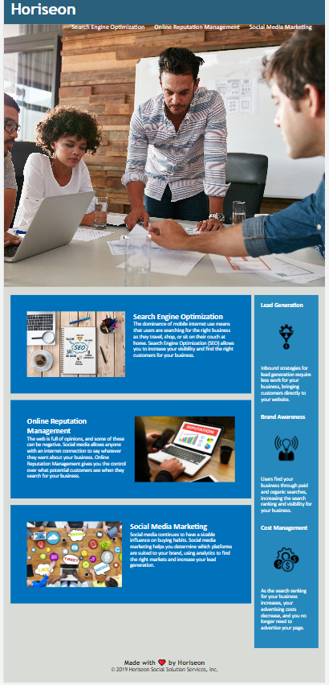

# Horiseon Marketing Website

## Description

Horiseon Marketing Website provide Search Engine Optimization, Online Reputation Managment and Social Media Marketing. In Search Engine Optimization increase website's visibility and find the right business. In Online Reputation Managment provide to control on search for business. In Social Media Marketing helps to determine which platforms are suited to brand using analytics, also find the right market and increase lead generation. There is also lead generation,Brand Awareness and Cost Management tabs to manipulate product usages.

## Installation

N/A

## Usage
This website is used by campanies to escalate their product, when they deployed their product on website.They can have more profite in their busniess and the website is very user friendly So, anyone can use it.

## Credits

N/A

## License

N/A

## Assets

The following image demonstrates the website appearance:

